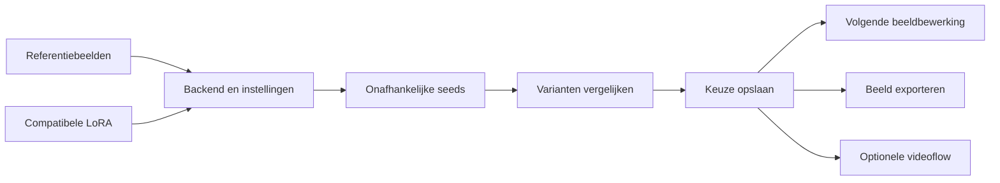
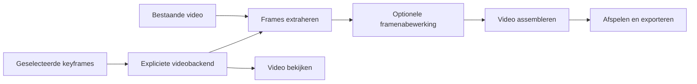

# Implementatieplan voor betrouwbare backends en een volledige TUI-flow

Dit voorstel volgt de [review](review.md). Het verandert de opdracht in `docs/PLAN.md` niet. De werkhypothese is uitbreiding van de bestaande workfloweditor; er is geen aparte wizard of tweede uitvoeringsengine nodig. Video is een optioneel vervolg op de beeld-/stijlflow.

**Eerste bruikbare eindresultaat:** een gebruiker kan referenties verbinden, instellingen en seeds kiezen, varianten maken, die vergelijken, één resultaat duurzaam selecteren en dat als input van een volgende bewerking of export gebruiken. Openen, opslaan, batchen en caching mogen de gekozen behandeling niet veranderen.

## 1. Herstel de bestaande eigenaarsfouten

Deze wijzigingen zijn afzonderlijke samenhangende implementaties. Iedere outputveranderende wijziging krijgt **in dezelfde wijziging** een passende implementatie-/cacherevisie.

| Onderdeel | Eigenaar | Concrete wijziging | Acceptatie |
|---|---|---|---|
| Inspectorinitialisatie | `workflow_editor.py`, `workflow_edit_buffer.py`, `workflow_inspector.py` | Scheid tonen van een waarde van het wijzigen ervan; pas defaults uitsluitend bij een echte backend/model/profielwisseling toe | Een opgeslagen graph blijft byte-equivalent na openen/selecteren; aangepaste Qwen-, AnimeGen- en postprocesswaarden blijven behouden na Save/Undo/Redo |
| Impliciete defaults | `workflow_inspector.py`, bestaande settingsresolver | Projecteer `None` als een expliciete backenddefault zonder het opgeslagen document te muteren | Iedere compiler-geldige samplingconfig kan geopend en bewerkt worden; lege/defaultwaarden overleven save/load |
| Klein referenties | `generation/flux2_klein.py`, bestaande imageprocessor | Verwijder de impliciete neurale voorbewerking; gebruik een expliciet referentiebeleid met eigen aspect; scheid referentiecontext van init-image | Portret en landschap behouden hun vorm; dezelfde referentie krijgt dezelfde conditioning bij andere outputcanvassen en batchvolgorden |
| Klein strength | Dezelfde conditioner-/denoise-owners | Maak de relatie tussen initcanvas, latenttokens en positie-ID's correct; behoud overige referenties volgens het bedoelde editcontract | Twee refs bereiken ook met strength de bedoelde modelinputs; ondersteunde grotere canvassen hebben identieke token-/positieaantallen |
| VOSR randomness | `generation/vosr_runtime.py`, `vosr_backend.py` | Seed/RNG per zelfstandig outputartifact; modelgewichten eenmaal per batch laden | B alleen, A+B en A-gecachet+B gebruiken dezelfde initiële ruis voor B; geen extra modelreload per beeld |
| Dubbele seeds | Bestaande `image-edit` request-/outputeigenaar | Eén uniform contract voor dubbele seeds en unieke output-ID's | Geen twee resultaatrecords met onbedoeld dezelfde bestemming |
| Beeldoriëntatie en alfa | SAM-invoer en bestaande image-I/O-/postprocessowners | Eén genormaliseerde pixeloriëntatie; alfa inclusief palettransparantie als expliciet beeldgegeven bewaren of de gekozen bewerking expliciet beperken | SAM-canvas en model zien dezelfde pixels/coördinaten; RGBA- en palet-PNG-contracten zijn aantoonbaar correct |
| Runstatus | TUI-runstate naast het editbuffer | Koppel getoonde resultaten aan de uitgevoerde inhoudsrevisie en inputs | Na inhoudelijke wijziging zijn relevante oude successen herkenbaar als oud; layout/titelwijziging houdt geldige resultaten bruikbaar |

Voeg geen algemene guards rond verkeerde toestanden toe. Het editbuffer bezit documentwijzigingen, de renderer toont ze, de backend bezit zijn conditionering en de cache bezit resultaatidentiteit. Controleer bestaande helpers vóór een nieuwe image-I/O-helper wordt ingevoerd.

## 2. Maak capabilities en resultaten consistent

Breid de bestaande `ImageEditBackendSettings` en resolvers gericht uit waar de UI/compiler informatie missen: referentierollen en aantallen, LoRA-architectuur, strength-betekenis, canvas/alignment en toegestane samplingopties. Gebruik dezelfde feiten voor formulier, inspector en compilatie. Laat gespecialiseerde numerieke uitvoering in de huidige backendmodules.

Voor video komt een expliciete backendkeuze met eigen configuratietypen voor AnimeGen, LTX en Hunyuan. Start/eind/interne keyframes, frameaantal, fps en audio zijn capabilities van de betreffende route. Geen stilzwijgende modelwissel wanneer iets niet wordt ondersteund.

Leg per uitgevoerd outputartifact vast:

- effectieve instellingen en seed, inclusief gekozen preprocessing;
- geordende inputidentiteiten en LoRA-identiteit/gewicht;
- backend-, model-, lokale implementatie- en relevante runtimepatchrevisies;
- outputbestanden en hun gemeten afmetingen; voor video frames, fps/tijdbasis en audio;
- logs, fase-/geheugenmetingen en verwijzingen naar eventuele auditresultaten.

Gebruik de bestaande atomische manifest-/cacheowners. Bewaar de originele runresultaten achter de UI; een tijdelijke workerfolder of alleen stdout is geen duurzame geschiedenis. Hash en resolveer bij de artifact-/rungrens, niet in render- of denoiselussen. Vergelijk gevraagde en daadwerkelijk gemeten video-eigenschappen vóór publicatie.

**Acceptatie:** dezelfde uitvoering via CLI en TUI heeft dezelfde effectieve aanvraag; een implementatiewijziging kan geen oude cache-entry hergebruiken; een resultaat blijft inspecteerbaar na sluiten en opnieuw starten van de app. Ontbrekende runtimes geven vóór een lange uitvoering een concrete fout bij de gekozen stap. Dit vervangt geen bewezen modelvalidatie op 16GB.

## 3. Bouw eerst de volledige beeld-/stijlflow

Gebruik `workflow_graph.py`, `workflow_compilation.py`, `workflow_execution.py` en de bestaande cache als de enige uitvoering. De losse formulieren kunnen een overeenkomstige node/graph openen of starten; ze krijgen geen eigen parallelle uitvoeringslogica.

Voeg alleen de ontbrekende gegevensbegrippen toe:

1. **Een collectie kandidaatbeelden.** Ieder beeld heeft een stabiele output-ID, seed, pad en provenance. Dit is geen videoframesequentie: kandidaten hebben geen temporele betekenis.
2. **Een expliciete beeldselectie.** De keuze verwijst naar de identiteit van een bestaand kandidaatartifact en wordt opgeslagen. Een bestandsnaam of veranderlijke lijstindex alleen is onvoldoende.
3. **Uitvoering tot een gekozen resultaatgrens.** “Maak varianten” voert de benodigde voorouders uit. Na selectie kan dezelfde graph verder, met hergebruik van eerdere resultaten. Een ontbrekende keuze voor een gevraagde vervolgstap geeft een duidelijke preflightfout; er wordt geen willekeurige kandidaat gekozen.
4. **Resultaatinspectie in de TUI.** Een geselecteerde node toont input-/outputthumbnails, seed, effectieve instellingen, vorige runs, log en open-/exportactie. Variantsvergelijking gebruikt dezelfde weergaveschaal. Previewresolutie verandert nooit modelreferenties.

Voor een eerste versie hoeft niet iedere vorm van batchmapping, dynamische subgraph of scheduleruitbreiding generiek ontworpen te worden. Een seedcollectie met één expliciete selectie dekt het primaire gebruik. Behoud de bestaande geordende referentieverbindingen en undo/redo.

**Acceptatiepad:** nieuw document → twee geordende refs → expliciete Qwen- of Klein-node → meerdere seeds → save → sluiten/herladen → uitvoeren → varianten bekijken → selectie opslaan → vervolgbewerking → output openen. Vervolgens één seed of één referentie wijzigen: alleen de inhoudelijk geraakte resultaten worden opnieuw gemaakt. Alle fasen zijn via opgeslagen artifacts te hervatten.

De eerste neurale acceptatierun gebruikt één kleine, concreet gekozen matrix op deze GPU, met vooraf beoordeelde prompts. Eerdere native-VAE-ablation geldt niet als vervanging voor deze acceptatie.

## 4. Sluit video aan op dezelfde flow

Maak LTX en Hunyuan werkelijk verbindbaar naast AnimeGen. Voeg een videobron toe zodat bestaande video's kunnen worden gebruikt, plus de ontbrekende assemblage/export na framenabewerking.

Een framesequentie draagt geordende frame-identiteiten én tijdinformatie. Audio is een expliciete behouden, verwijderde of vervangen track. De huidige LTX-route verwijdert audio; dat hoort zichtbaar bij de route. Geef voor keyframes met verschillende bronaspecten een expliciet fit/crop/pad-beleid. Beeldnummers van de gebruiker en backendindexering worden één keer vertaald aan de adaptergrens.

**Acceptatie:** start/eind en interne LTX-keyframes behouden hun frameposities; import → extractie → assemblage behoudt framevolgorde, frameaantal en afgesproken tijdsduur; output met audio volgt de gekozen policy. Nabewerkte frames leveren een nieuw speelbaar eindbestand op. AnimeGen/LTX/Hunyuan worden ieder afzonderlijk gevalideerd met hun eigen instellingen; een geslaagde route activeert geen automatische fallback voor een andere.

Dit deel is optioneel voor de dagelijkse stijlworkflow. Het is wel nodig om de aangeboden videofuncties in de TUI een volledige flow te laten vormen.

## 5. Sluit specifieke karakter- en maskerroutes correct aan

Een gewone beeldbewerking krijgt geen impliciete karakteranalyse. Een expliciete karakterroute moet juist de raw-audit en begrensde retry uit `docs/PLAN.md` uitvoeren vóór postprocessing. Gebruik modelgeproduceerde identiteit-/auditartifacts en visuele referenties; voeg geen handgeschreven karakterbeschrijving, silhouetmetingen of personageconstanten toe.

SAM produceert een mask-artifact dat als expliciete invoer van een ondersteunde lokale edit kan dienen. “SAM Edit” is nu segmentatie; het bestaan van een masker maakt een backend nog niet geschikt voor native masked editing. Sluit dat alleen aan op een route die dit daadwerkelijk ondersteunt en voldoet aan het karaktercontract.

De bestaande LoRA-training richt zich op FLUX.1. Het laden van een Klein- of Qwen-LoRA is geen bewijs dat de app die LoRA al kan trainen. Toon compatibiliteit bij dataset/training/import als aparte capabilities. Nieuwe training behoort niet tot de eerste noodzakelijke TUI-uitbreiding.

## Verificatievolgorde en praktische grenzen

1. Maak de gedateerde bugproeven tot regressies met het gewenste gedrag, bij de relevante fixes. Houd neurale doubles herkenbaar.
2. Test document/configbehoud, inputvolgorde, gerichte invalidatie en cachepublicatie op CPU. Maak wijzigingen in rendering geen reden om modellen opnieuw te draaien.
3. Test de echte TUI → CLI → resultatenketen en Stop. Test het openen van compiler-geldige oude documenten, ook met impliciete defaults.
4. Voer daarna doelgerichte GPU-acceptatie uit per gewijzigde route. Meet conditionering, denoise en decode; vermeld resolutie, referentieaantal, VRAM en eventueel swap. Vermijd algemene “werkt op 16GB”-claims op grond van één fasepiek.
5. Beoordeel stijlconsistentie met dezelfde inputinhoud en afzonderlijk vastgelegde seedvarianten. Een verandering aan preprocessing, sampler of LoRA mag geen verborgen tweede veranderlijke factor zijn.

De bestaande renderer heeft behouden scenegeometrie, hit-indexen en rijcaching; die structuur blijft bruikbaar. Laad/resize previews alleen wanneer artifact of viewport verandert. Bewaar modelhergebruik bij batching, maar maak resultaten onafhankelijk van batching en eerdere cachehits. Eindig iedere implementatieslice met passende checks en `git diff --check`; commit of verwijder niets zonder expliciete opdracht.
